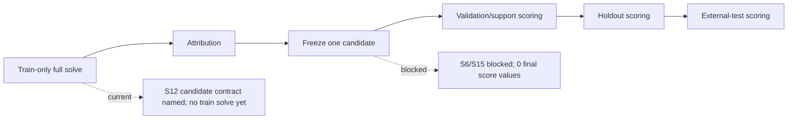

# Predictive Path Status Diagram

Caption: the rigorous sequence is train-only full solve, attribution, freeze,
validation, holdout, and external-test. Current evidence stops before the
train-only solve for the named S12 contract, so the final scorecard remains a
blocked shell with `0` final score values.
