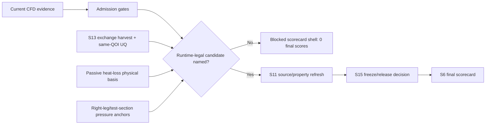

---
provenance:
  - work_products/2026-07/2026-07-21/2026-07-21_thesis_figtable_s6_blocked_scorecard_shell/blocked_scorecard_visual_table.csv
  - work_products/2026-07/2026-07-21/2026-07-21_thesis_figtable_s9_upcomer_exchange_evidence/exchange_qoi_figure_contract.csv
  - work_products/2026-07/2026-07-21/2026-07-21_thesis_figtable_s10_pressure_f6_gate_waterfall/pressure_f6_gate_waterfall.csv
  - work_products/2026-07/2026-07-21/2026-07-21_fluid_extbc_phase_h2_passive_heat_loss_attribution/tw5_response_waterfall.csv
tags: [thesis, figure-draft, blocked-scorecard, future-work]
task: TODO-THESIS-MAINTEXT-WRITEUP-TABLE-POLISH-PACK-2026-07-21
date: 2026-07-21
role: Writer/Reviewer/Figures
type: work_product
status: complete
---
# Figure Draft: Blocked Scorecard And Future-Work Release Path

Caption draft: The final scorecard is intentionally blocked until exactly one
runtime-legal candidate passes source/property, split, and uncertainty gates.
The next release paths are not broad tuning sweeps: they are S13 exchange
harvest/UQ, passive heat-loss physical-basis evidence, and ordinary pressure
anchors in `right_leg` or `test_section_span`. No final predictive score is
released from the current evidence.
